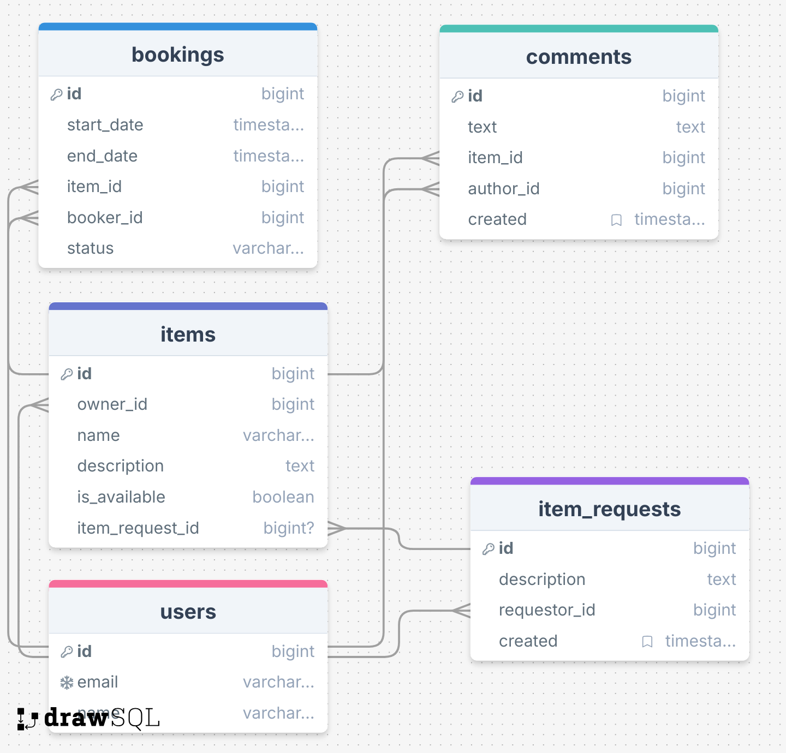

# Shareit project

Представьте, что на воскресной ярмарке вы купили несколько картин и хотите повесить их дома. Но вот незадача — для этого
нужна дрель, а её у вас нет.

Можно, конечно, пойти в магазин и купить, но в такой покупке мало смысла — после того, как вы повесите картины, дрель
будет просто пылиться в шкафу. Можно пригласить мастера — но за его услуги тоже нужно заплатить.

И тут вы вспоминаете, что видели дрель у друга. Сама собой напрашивается идея — одолжить её. Большая удача, что у вас
оказался друг с дрелью и вы сразу вспомнили про него! Иначе в поисках инструмента пришлось бы писать всем друзьям и
знакомым. Или вернуться к первым двум вариантам — покупке дрели или найму мастера.

Насколько было бы удобнее, если бы под рукой был сервис, с помощью которого пользователи делятся вещами!

Shareit и есть именно такой проект.

## Стек технологий

* Java 21, Spring Boot, Lombok, Hibernate, PostgreSQL, H2Database, REST API, Maven, JUnit

## Архитектура

Сервис состоит из двух модулей:

* ### gateway
* ### server

## Описание API

## User API

| HTTP request                 | Method        | Description                                 |
|------------------------------|---------------|---------------------------------------------|
| **GET** `/users`             | `getAllUsers` | Получить список всех пользователей          |
| **GET** `/users/{userId}`    | `getUser`     | Получить пользователя по ID                 |
| **POST** `/users`            | `createUser`  | Создать нового пользователя                 |
| **PATCH** `/users/{userId}`  | `updateUser`  | Частично обновить данные пользователя по ID |
| **DELETE** `/users/{userId}` | `deleteUser`  | Удалить пользователя по ID                  |

## Item API

| HTTP request                        | Method         | Description                                      |
|-------------------------------------|----------------|--------------------------------------------------|
| **GET** `/items`                    | `getUserItems` | Получить список всех вещей пользователя          |
| **GET** `/items/{itemId}`           | `getItemById`  | Получить информацию о вещи по ID                 |
| **POST** `/items`                   | `addNewItem`   | Добавить новую вещь                              |
| **DELETE** `/items/{itemId}`        | `deleteItem`   | Удалить вещь по ID                               |
| **PATCH** `/items/{itemId}`         | `updateItem`   | Обновить вещь по ID                              |
| **GET** `/items/search?text={text}` | `searchItems`  | Поиск доступных вещей по ключевым словам         |
| **POST** `/items/{itemId}/comment`  | `addComment`   | Добавить комментарий к вещи (после бронирования) |

## Booking API

| HTTP request                            | Method                | Description                                                    |
|-----------------------------------------|-----------------------|----------------------------------------------------------------|
| **POST** `/bookings`                    | `createBooking`       | Создать новое бронирование                                     |
| **PATCH** `/bookings/{bookingId}`       | `updateBookingStatus` | Подтвердить или отклонить бронирование (владелец вещи)         |
| **GET** `/bookings/{bookingId}`         | `getBookingById`      | Получить информацию о бронировании по ID                       |
| **GET** `/bookings?state={state}`       | `getUserBookings`     | Получить список бронирований текущего пользователя             |
| **GET** `/bookings/owner?state={state}` | `getOwnerBookings`    | Получить список бронирований для всех вещей текущего владельца |

## Item Request API

| HTTP request                    | Method                               | Description                                                          |
|---------------------------------|--------------------------------------|----------------------------------------------------------------------|
| **POST** `/requests`            | `createNewRequest`                   | Создать новый запрос на вещь                                         |
| **GET** `/requests`             | `findAllRequestsByUserWithResponses` | Получить все свои запросы вместе с откликами на них                  |
| **GET** `/requests/all`         | `getAllRequests`                     | Получить все запросы других пользователей (опционально с пагинацией) |
| **GET** `/requests/{requestId}` | `getRequestById`                     | Получить подробную информацию о конкретном запросе                   |

## ER диаграмма

## Дамп БД

- [schema.sql](server/src/main/resources/schema.sql)